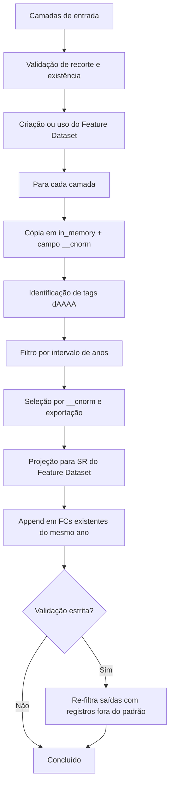

# Split Desmatamento por Ano (Multi-entrada) — V5

Toolbox Python (`.pyt`) para **ArcGIS Pro** que divide camadas vetoriais de desmatamento em múltiplas feature classes, **uma por ano**, com base no campo `class_name` no padrão PRODES (`dAAAA`).

Arquivo principal: `Split_Desmatamento_Multi_v5.pyt`

---

## Visão geral

A ferramenta **Gerar FCs por Ano (camadas abertas, dAAAA) — V5** processa uma ou mais camadas vetoriais (abertas no mapa ou referenciadas por caminho) e gera feature classes separadas por ano de desmatamento dentro de um **Feature Dataset** em uma geodatabase de saída.

A versão **V5** introduz:

- **Normalização em memória** do campo `class_name`, sem alterar os dados de origem
- **Validação estrita** das saídas, com re-filtragem automática quando necessário

---

## Requisitos

| Requisito | Detalhe |
|-----------|---------|
| Software | ArcGIS Pro (com licença que permita geoprocessamento) |
| Linguagem | Python 3 (ambiente integrado ao ArcGIS Pro) |
| Biblioteca | `arcpy` |
| Dados de entrada | Feature classes ou shapefiles com o campo **`class_name`** |

---

## Padrão de dados esperado

### Campo obrigatório

As camadas de entrada devem conter o campo **`class_name`**.

### Formato das classes de desmatamento

Os valores válidos seguem o padrão **`dAAAA`**, em que `AAAA` é o ano (ex.: `d2008`, `d2015`, `d2023`).

A V5 aplica normalização antes da seleção:

```
(class_name ou '').strip().lower()[:5]
```

Isso significa que variações como espaços extras ou diferenças de maiúsculas/minúsculas são tratadas automaticamente. O dado fonte **não é modificado** — a normalização ocorre em uma cópia temporária em `in_memory`, no campo auxiliar `__cnorm`.

---

## Recortes geográficos suportados

Cada camada de entrada deve ser associada a um recorte geográfico. Esse valor define o **prefixo** do nome das feature classes de saída:

| Recorte | Prefixo de saída |
|---------|------------------|
| Cerrado | `cerr_` |
| Amazônia | `amaz_` |
| Caatinga | `caat_` |
| Mata Atlântica | `mata_` |
| Pampa | `pamp_` |
| Pantanal | `pant_` |
| Amazônia Legal | `amzL_` |

### Exemplo de nomenclatura de saída

Para o recorte **Cerrado** e o ano **2015**, a feature class gerada será:

```
cerr_d2015
```

---

## Parâmetros da ferramenta

| Parâmetro | Tipo | Obrigatório | Descrição |
|-----------|------|-------------|-----------|
| **Entradas (uma linha por camada)** | Tabela de valores | Sim | Cada linha associa uma **camada** (`GPFeatureLayer`) a um **recorte geográfico** |
| **File Geodatabase de saída (*.gdb)** | Workspace | Sim | Geodatabase local onde as saídas serão gravadas |
| **Feature Dataset de saída** | Texto (lista dinâmica) | Sim | Nome do Feature Dataset de destino. Se não existir, será criado automaticamente |
| **Ano inicial (opcional)** | Inteiro | Não | Limita o processamento ao ano mínimo desejado |
| **Ano final (opcional)** | Não | Inteiro | Limita o processamento ao ano máximo desejado |
| **Sobrescrever outputs existentes?** | Booleano | Não | Padrão: `True`. Se `False`, feature classes já existentes são preservadas |
| **Validar saídas e re-filtrar se necessário** | Booleano | Não | Padrão: `True` (recomendado). Ativa a validação estrita ao final |

### Comportamento dos anos

- Se **ano inicial** e **ano final** não forem informados, a ferramenta processa **todos os anos** encontrados na camada.
- Se apenas um dos limites for informado, o outro extremo é inferido a partir dos dados disponíveis.
- Se o intervalo informado não contiver anos válidos, a camada é ignorada com aviso.

---

## Fluxo de processamento



### Etapas principais

1. **Validação das entradas** — verifica recorte, camada e existência do campo `class_name`
2. **Feature Dataset** — cria o dataset com a referência espacial da primeira entrada válida, ou reutiliza um existente
3. **Normalização** — cópia temporária em memória com campo `__cnorm`
4. **Descoberta de anos** — identifica todas as tags `dAAAA` presentes nos dados
5. **Exportação** — para cada ano no intervalo, seleciona registros e grava a feature class de saída
6. **Projeção** — reprojeta para o sistema de coordenadas do Feature Dataset, se necessário
7. **Append** — se a mesma saída for alcançada por mais de uma entrada, os registros são acrescentados
8. **Validação final** — remove registros cuja normalização de `class_name` não corresponde ao ano esperado

---

## Como usar no ArcGIS Pro

### 1. Adicionar a toolbox

1. Abra o **ArcGIS Pro**
2. No painel **Catálogo**, clique com o botão direito em **Toolboxes**
3. Selecione **Adicionar Toolbox**
4. Navegue até `Split_Desmatamento_Multi_v5.pyt`

### 2. Preparar os dados

1. Adicione as camadas de desmatamento ao mapa (recomendado) ou tenha os caminhos dos shapefiles/feature classes
2. Confirme que todas possuem o campo `class_name` com valores no padrão `dAAAA`

### 3. Executar a ferramenta

1. Abra a ferramenta **Gerar FCs por Ano (camadas abertas, dAAAA) — V5**
2. Na tabela de entradas, adicione uma linha para cada camada:
   - **Coluna 1:** selecione a camada no mapa
   - **Coluna 2:** escolha o recorte geográfico correspondente
3. Informe a **geodatabase de saída**
4. Selecione ou digite o nome do **Feature Dataset de saída**
5. (Opcional) Defina o intervalo de anos
6. Mantenha **Validar saídas** ativado, salvo necessidade contrária
7. Execute

### 4. Verificar resultados

As feature classes geradas ficam dentro do Feature Dataset informado, com nomes no formato `{prefixo}d{ano}`.

---

## Estrutura de saída

```
saida.gdb/
└── NomeDoFeatureDataset/
    ├── cerr_d2008
    ├── cerr_d2009
    ├── amaz_d2010
    └── ...
```

Cada feature class contém apenas os polígonos (ou feições) cujo `class_name`, após normalização, corresponde ao ano daquela camada.

---

## Mensagens, avisos e erros

### Avisos comuns

| Situação | Comportamento |
|----------|---------------|
| Camada sem campo `class_name` | Camada ignorada |
| Nenhuma tag `dAAAA` após normalização | Camada ignorada |
| Nenhum ano no intervalo solicitado | Camada ignorada com indicação dos anos disponíveis |
| Saída já existe com `overwrite=False` | Feature class existente é mantida |

### Erros que interrompem a execução

| Situação | Mensagem típica |
|----------|-----------------|
| Tabela de entradas vazia | *"Adicione pelo menos uma linha com a camada e o recorte."* |
| Recorte inválido | *"recorte inválido. Selecione um valor da lista."* |
| Camada não encontrada | *"camada não encontrada"* |
| Ano inicial maior que final | *"Ano inicial > ano final"* |
| Impossível determinar SR para criar o FD | *"Não foi possível determinar a referência espacial..."* |

---

## Observações técnicas

- A ferramenta pode ser executada em **segundo plano** (`canRunInBackground = True`)
- Dados temporários são criados em `in_memory` e removidos ao final de cada etapa
- O campo auxiliar `__cnorm` existe apenas nas cópias temporárias, não nas fontes nem necessariamente nas saídas finais
- Quando múltiplas entradas geram a mesma feature class de saída (mesmo recorte e mesmo ano), os registros são combinados via **Append** (`schema_type='NO_TEST'`)
- A validação estrita recria a feature class de saída se detectar registros cuja normalização de `class_name` difere do ano esperado

---

## Histórico de versão

| Versão | Destaques |
|-------|-----------|
| **V5** | Normalização de `class_name` em memória; validação estrita com re-filtragem; suporte a múltiplas entradas com tabela de valores; criação automática de Feature Dataset |

---

## Licença e autoria

Desenvolvida para uso com dados de desmatamento no padrão PRODES, em fluxos de trabalho no **ArcGIS Pro**.

Para dúvidas ou melhorias, documente o contexto de uso (recorte, intervalo de anos, tipo de entrada e mensagens de erro/aviso exibidas na execução).
